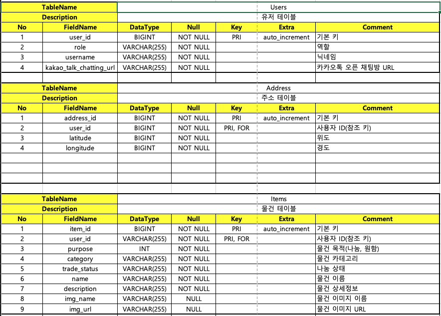
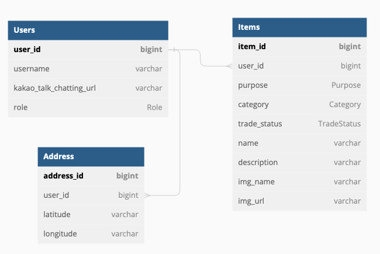

# Levains-backend

 

## 시연영상

## ⚙️ 개발 환경(Development Environment)

| 분류 | 개발환경                                    | 
|---|-----------------------------------------|
| 운영체제 | Mac OS                                  |
| 개발도구 | WebStorm, Postman, Swagger              |
| 프레임워크 | Express.js 4.18.2                       |
| 데이터베이스 | MySQL                    |
| 버전 관리 | Github, Git                             |
| 배포 및 운영 | AWS, Docker, Github Actions             |
| 오픈소스 및 외부 라이브러리 | JSON Web Token API, Swagger UI, AWS-SDK |

## 🛠 세부 기술 스택(Tech Stack)

- **Node.js 16.15.0**
- **Typescript 4.9.3**
- **Express.js 4.18.2**

- **AWS(Amazon Web Service)**
    - AWS ECS
    - AWS Route 53
    - AWS Elastic Load Balancing
    - AWS RDS
    - AWS S3

### 데이터베이스(Database)

- **MySQL**

## 📝 테이블 정의서(Entity Details)

## 🔗 엔티티-관계 모델(Entity Relationship Diagram)

## 📌 API 명세서(API Specification)